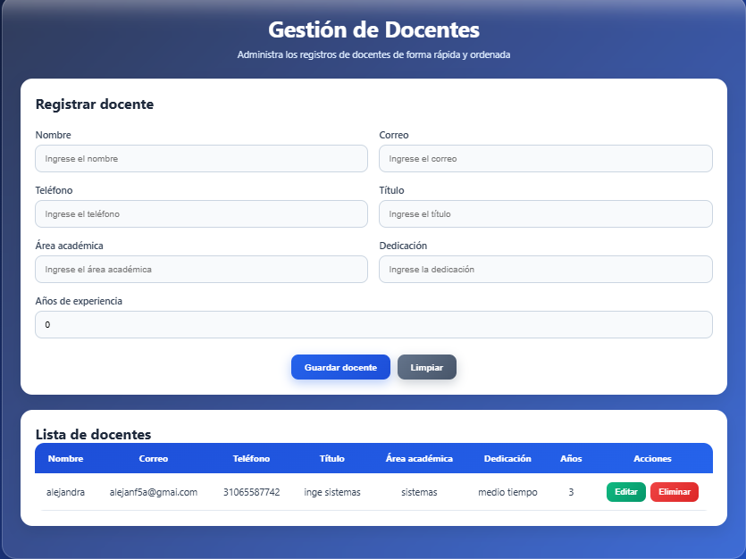
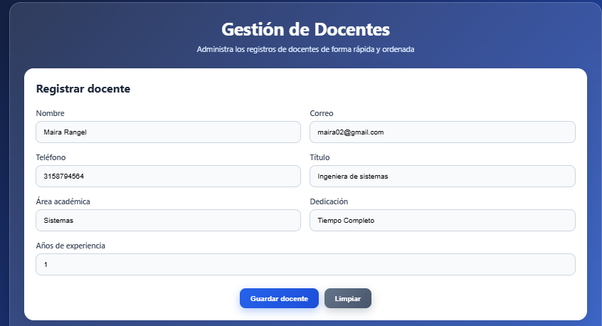
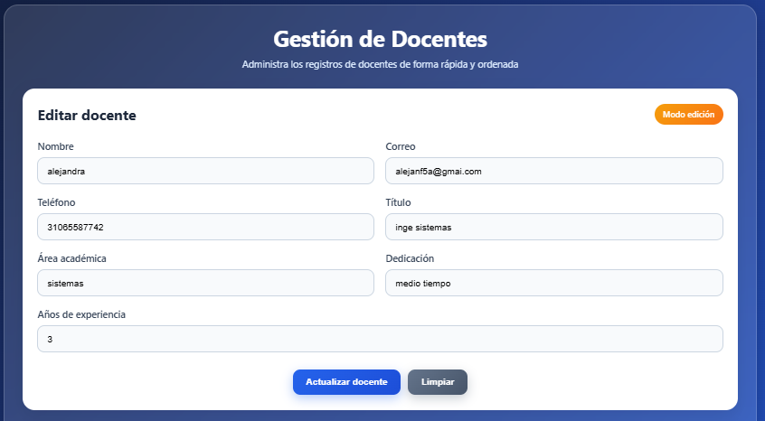
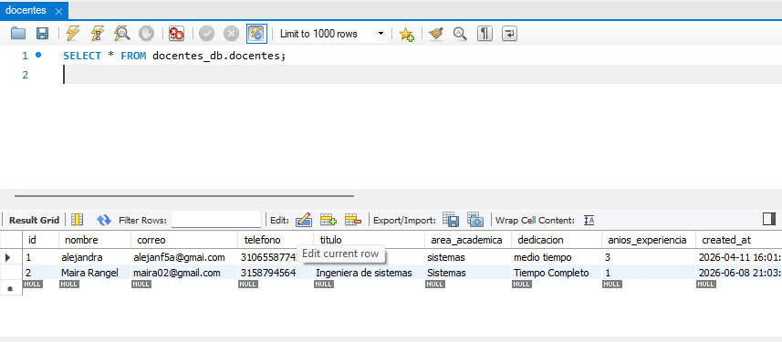

# 🎓 Universidad Dev Senior

Sistema web Full Stack para la gestión de docentes desarrollado con **React**, **Node.js**, **Express** y **MySQL**.

---

## 📖 Descripción

Universidad Dev Senior es una aplicación web orientada a la administración de docentes mediante operaciones CRUD (Crear, Consultar, Actualizar y Eliminar). El proyecto implementa una arquitectura cliente-servidor donde el frontend consume una API REST desarrollada con Node.js y Express, mientras que la información se almacena en una base de datos MySQL.

---

## ✨ Características principales

* Gestión completa de docentes (CRUD).
* Interfaz desarrollada con React.
* Backend con Node.js y Express.
* Persistencia de datos en MySQL.
* Comunicación mediante API REST.
* Validación de formularios.
* Separación entre frontend y backend.

---

## 🛠️ Tecnologías utilizadas

### Frontend

* React
* JavaScript
* CSS3
* Fetch API

### Backend

* Node.js
* Express.js
* MySQL

### Herramientas

* Visual Studio Code
* Git
* GitHub
* MySQL Workbench
* Postman

---

## 🏗️ Arquitectura del proyecto

```text
UniversidadDevSenior/
│
├── client/
│   ├── public/
│   └── src/
│       ├── App.js
│       ├── App.css
│       └── index.js
│
├── server/
│   ├── index.js
│   ├── db.js
│   ├── package.json
│   └── ...
│
├── screenshots/
└── README.md
```

---

## 📸 Capturas

### Página principal



### Registro de docentes



### Edición de docentes



### Base de datos



---

## 🗄️ Base de datos

El proyecto utiliza **MySQL** para almacenar la información de los docentes y soportar las operaciones CRUD realizadas desde la aplicación.

---

## 🔗 API REST

| Método | Endpoint         | Descripción          |
| ------ | ---------------- | -------------------- |
| GET    | `/docentes`      | Listar docentes      |
| GET    | `/docentes/{id}` | Consultar un docente |
| POST   | `/docentes`      | Crear docente        |
| PUT    | `/docentes/{id}` | Actualizar docente   |
| DELETE | `/docentes/{id}` | Eliminar docente     |

---

## 🚀 Instalación

### Requisitos previos

* Node.js
* npm
* MySQL

### Frontend

```bash
cd client
npm install
npm start
```

### Backend

```bash
cd server
npm install
npm run dev
```

---

## ✅ Estado del proyecto

Proyecto funcional y probado para fines académicos y de portafolio profesional.

Incluye:

* ✔ Gestión de docentes
* ✔ API REST
* ✔ Persistencia en MySQL
* ✔ Frontend en React
* ✔ Backend en Node.js y Express

---

## 👩‍💻 Autora

**Maira Alejandra Rangel Murillo**
Ingeniera de Sistemas

Proyecto desarrollado con fines académicos y como parte de un portafolio profesional orientado al desarrollo Full Stack.
